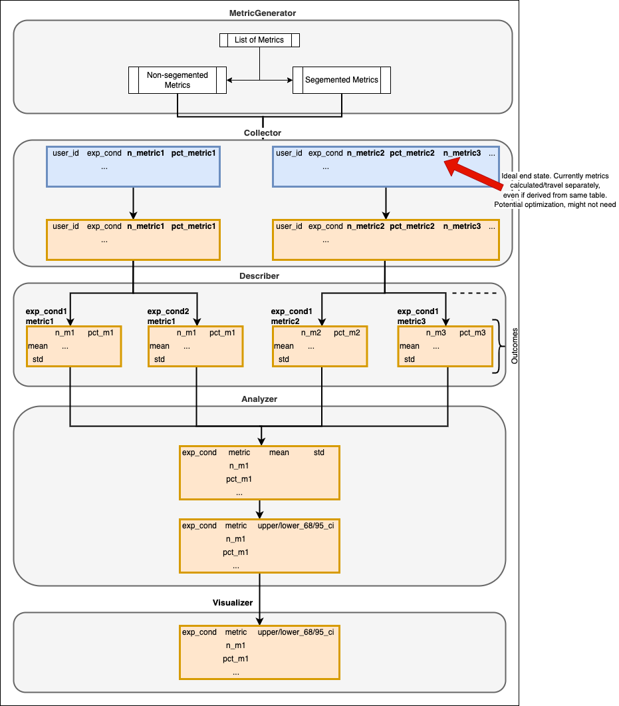

# abautomator
A/B testing at the press of a button

## Table of Contents
1. [Setup](#setup)
2. [Add a metric](#add-a-metric)
3. [Data Architecture](#data-architecture)

## Setup

### Local Backend Development 

```bash
# Should only need to run these gcloud commands once
gcloud auth login
gcloud auth application-default login

docker build -f Dockerfile.abautomator -t abauto .
docker run -ti --rm                             \
    -v ${PWD}:/abautomator                       \
    -v=$HOME/.config/gcloud:/root/.config/gcloud  \
    abauto
```

To run the test suite from scratch:

```bash
rm tests/cache/*.p && clear && pytest -v tests/
```

### Local web development

```bash
docker build -f Dockerfile.app -t app .
docker run -d --rm -p 8000:5000                 \
    -v ${PWD}:/abautomator                       \
    -v=$HOME/.config/gcloud:/root/.config/gcloud  \
    -e FLASK_ENV=development                       \
    app
```

### Jupyter

Useful for working on visualization stuff

```bash
docker run -p 8888:8888                    \
    -v ${PWD}:/home/jovyan/work            \
    jupyter/scipy-notebook:33add21fab64 
```

To pickle the analysis object used to build the jupyter viz:

```bash
clear && pytest tests/test_get_analy.py --runbuild
```

JupyterLab terminal:

```bash
pip install -U pandas
```

## Add a metric

1. Using any of the exiting metrics as a template, create your python file in the appropriate subfolder of `metrics/` 
2. Add the metric object to `metric_lookup.METRIC_LOOKUP` with an appropriate key. IMPORTANT - Metric obj must return query with columns [`echelon_user_id`, `n_<metric_key>`, `pct_<metric_key>`]
3. For testing, add the raw sql to `tests/metrics/raw_queries.py` using the same key as from 2 above
4. That's it! Run test for your metric using `pytest tests/metrics/test_metrics.py -- name <metric key from 2>`

## Data Architecture


[Edit](https://app.diagrams.net/#Hruben-cit%2Fabautomator%2Fmain%2Fimages%2Fdata_arch.drawio.png)
